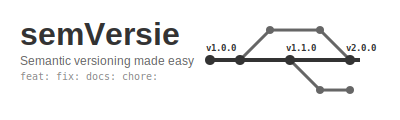

# semVersie

`[vɛrzi]` Is the dutch word for version,

This project calculates semantic-version bumps (major/minor/patch) from
conventional-commit style pull requests and can be used in a GitHub Actions
workflow to automatically determine the next release version.

We explicitly try to keep things simple by having the user deal with the
intricacies of the actual release process, this keeps the action relatively lean
and understandable without limiting the useability to a few languages.

## Usage (GitHub Actions)

Example workflow snippet that runs the action and exposes the computed version
as a job output:

```yaml
jobs:
  version:
    name: semVersie
    runs-on: ubuntu-latest
    permissions:
      contents: write
    outputs:
      version: ${{ steps.version.outputs.version }}
    steps:
      - name: Calculate version
        id: semVersie
        uses: RonaldPhilipsen/semVersie@vX.Y.Z
        with:
          # Optional: pass build metadata (e.g. commit SHA)
          build-metadata: ${{ github.sha }}
```

#### With PR Labels

To automatically label PRs with their version impact:

```yaml
name: PR Labeling
on:
  pull_request:
    types: [opened, synchronize, reopened]

permissions:
  contents: read
  pull-requests: read
  issues: write  # Required for adding labels

jobs:
  label:
    runs-on: ubuntu-latest
    steps:
      - uses: actions/checkout@v4
        with:
          fetch-depth: 0
      
      - name: Determine semver and label PR
        uses: RonaldPhilipsen/semVersie@vX.Y.Z
        with:
          add-pr-label: true
          label-prefix: false  # Set to true for "semVersie:minor" style labels
```

Please note that running this action from a non-fixed version is _not_ supported

### Inputs

| Input                  | Description                                                                                                                        | Required | Default                                                                                                            |
| ---------------------- | ---------------------------------------------------------------------------------------------------------------------------------- | -------- | ------------------------------------------------------------------------------------------------------------------ |
| `github-token`         | GitHub token for API access                                                                                                        | No       | `${{ github.token }}`                                                                                              |
| `build-metadata`       | Build metadata to include in the semver                                                                                            | No       | ``                                                                                                                 |
| `release-notes-format` | Format to fill in for the release notes generation                                                                                 | No       | `<INSERT_RELEASE_NOTES_HERE>` key will be replaced with release notes, [example](docs/resources/release-format.md) |
| `add-pr-label`         | Whether to add a label to the PR indicating the version impact. Requires `issues: write` permission.                               | No       | `false`                                                                                                            |
| `label-prefix`         | Whether to add the "semVersie:" prefix to PR labels (e.g., "semVersie:minor" instead of "minor")                                   | No       | `false`                                                                                                            |

> **Note:** The `github-token` input has a default value and typically doesn't
> need to be specified. If not provided, the action will fall back to local git
> operations without GitHub API access.

### outputs

| Output               | Description                                                                                   | Example                                                                         |
| -------------------- | --------------------------------------------------------------------------------------------- | ------------------------------------------------------------------------------- |
| `release`            | Boolean indicating whether a new release should be created                                    | `true`                                                                          |
| `release-notes`      | Generated release notes in markdown                                                           | See [example](https://github.com/RonaldPhilipsen/semVersie/releases/tag/v1.0.3) |
| `release-notes-file` | Generated release notes in markdown, dumped to a file on disk, useful for large release notes |                                                                                 |
| `prerelease`         | Boolean indicating whether the created release is a prerelease                                | `false`                                                                         |
| `tag`                | The semantic version in `tag` format,                                                         | `v1.2.3-rc0`                                                                    |
| `version`            | The semantic version in `semver` format,                                                      | `1.2.3-rc.0`                                                                    |
| `version-pep-440`    | The semantic version in `pep-440` format,                                                     | `1.2.3rc0`                                                                      |

## Development

The project uses Node.js for tests/build. Useful scripts (from `package.json`):

- npm run build — build the distribution (ncc)
- npm test — run tests
- npm run lint — run ESLint

## Contributing

Contributions are welcome. Please open issues or pull requests on the GitHub
repository. Follow the conventional commits format for PR titles so the tool can
infer versions correctly.
